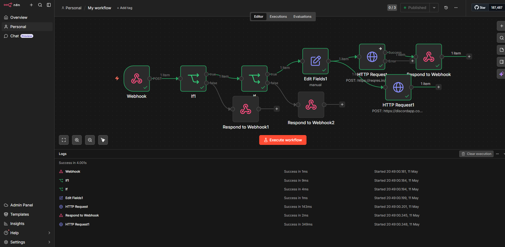
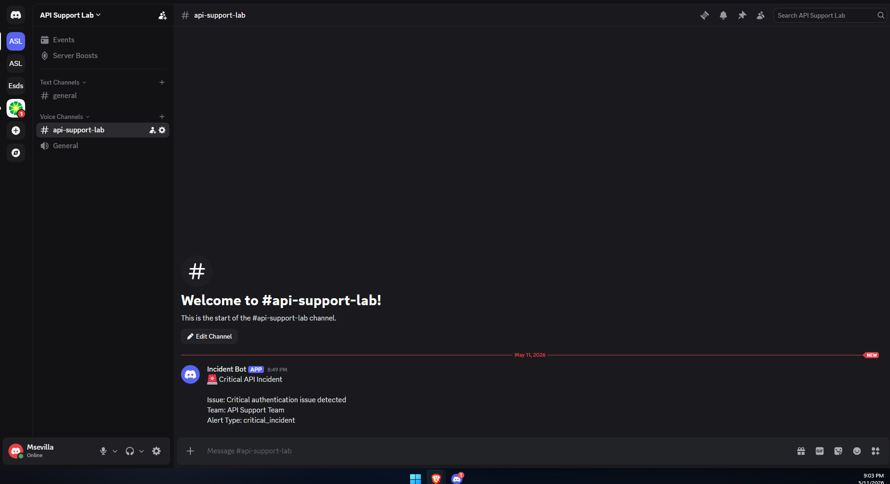

# API Incident Escalation Workflow

Automation workflow built in n8n for handling API support incidents, authentication validation, escalation routing, and Discord alert notifications.

## Features

* Webhook-based incident intake
* Authentication validation
* Severity classification
* Conditional routing
* Incident transformation
* External API integration
* Discord webhook notifications
* Custom JSON responses

## Workflow Architecture

Webhook → Credential Validation → Priority Classification → Incident Escalation → External API Request → Discord Notification → JSON Response

## Technologies Used

* n8n
* REST APIs
* Webhooks
* ReqRes API
* Discord Webhooks
* JSON

## Example Payload

```json id="qg7skw"
{
  "ticket_id": "INC-2001",
  "priority": "high",
  "issue": "OAuth token expired",
  "email": "eve.holt@reqres.in",
  "password": "cityslicka"
}
```

## Screenshots

### Workflow Overview



### Discord Alert Example


